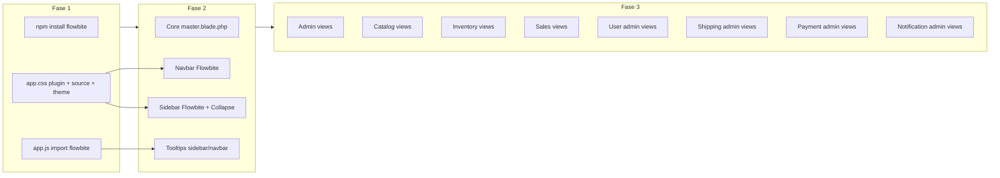

# OBJETIVO MASTER: REFATORAÇÃO GLOBAL DE UI/UX (FLOWBITE + TAILWIND V4 + TOOLTIPS)
Você é um Engenheiro de Frontend e UI/UX Sênior operando em modo Agent. Sua missão é refatorar TODO o painel administrativo do ecossistema Illuminar, substituindo os layouts básicos por componentes premium do **Flowbite**, mantendo Tailwind v4.1, e implementando "Dicas de Guia de Uso" (Tooltips) em todas as telas.
**REGRA ABSOLUTA:** É PROIBIDO o uso de CDN. O Flowbite deve ser instalado via npm. É PROIBIDO código "esqueleto". Nenhuma funcionalidade ou rota existente (Alpine.js, `x-mask`, requisições) pode ser quebrada. Mantenha os nossos ícones locais via componente `<x-icon style="duotone" />`.

## PLANO DE EXECUÇÃO (Siga a ordem rigorosamente, salve os arquivos a cada fase)

### FASE 1: Instalação e Configuração Local do Flowbite
1. Execute no terminal: `npm install flowbite`.
2. Edite `resources/js/app.js`: Adicione `import 'flowbite';` no final do arquivo para ativar os comportamentos interativos (como os Tooltips).
3. Edite `resources/css/app.css`: Como usamos Tailwind v4, adicione a diretiva `@source "../../node_modules/flowbite/**/*.js";` para que o Tailwind rastreie as classes do Flowbite, e adicione `@plugin "flowbite/plugin";` se for compatível.

### FASE 2: O Novo Layout Master (Sidebar e Navbar Premium)
1. Edite `Modules/Core/resources/views/layouts/master.blade.php`.
2. Substitua a Navbar atual pela **Navbar do Flowbite** (`<nav class="fixed top-0 z-50 w-full bg-white border-b border-gray-200 dark:bg-gray-800 dark:border-gray-700">`). Coloque a Logo, botão de toggle da sidebar, e no lado direito o Toggle de Dark Mode e Dropdown do Perfil de Usuário.
3. Substitua a Sidebar pela **Sidebar do Flowbite** (`<aside class="fixed top-0 left-0 z-40 w-64 h-screen pt-20 transition-transform -translate-x-full bg-white border-r border-gray-200 sm:translate-x-0 dark:bg-gray-800 dark:border-gray-700">`).
4. **Estrutura Exata da Sidebar (Restrinja via @hasanyrole/role quando aplicável):**
   - Dashboard (ícone `chart-pie`)
   - Início (ícone `house`)
   - **Usuários** (Grupo/Collapse): Usuários, Papéis
   - **Catálogo** (Grupo/Collapse): Produtos, Categorias, Marcas
   - **Estoque** (Grupo/Collapse): Kardex (Histórico), Nova Movimentação, Fornecedores
   - **Vendas** (Grupo/Collapse): Todos os Pedidos
   - **Entregas** (Grupo/Collapse): Métodos de Entrega, Entregas e Rastreio
   - **Configurações** (Grupo/Collapse): Métodos de Entrega, Gateways de Pagamento, Solicitações de Conta, Segurança, E-mails Automáticos
   - (Bottom da Sidebar): Botões "Sair" e Toggle de "Escuro/Claro".
5. Aplique `data-tooltip-target="tooltip-nome"` aos botões da Sidebar quando ela estiver colapsada (se aplicar lógica colapsável) ou nos botões de ações da Navbar. Crie os elementos `
`.

### FASE 3: Refatoração das Views (Padrão Flowbite)
Você deve varrer as views de TODOS os módulos abaixo e aplicar o padrão visual do Flowbite:
- **Tabelas:** Use as classes `relative overflow-x-auto shadow-md sm:rounded-lg`. O `<thead class="text-xs text-gray-700 uppercase bg-gray-50 dark:bg-gray-700 dark:text-gray-400">`.
- **Formulários:** Substitua inputs genéricos por Flowbite Inputs (`bg-gray-50 border border-gray-300 text-gray-900 text-sm rounded-lg focus:ring-primary-600 focus:border-primary-600 block w-full p-2.5 dark:bg-gray-700 dark:border-gray-600 dark:placeholder-gray-400 dark:text-white dark:focus:ring-primary-500 dark:focus:border-primary-500`).
- **Botões:** Use `text-white bg-primary-700 hover:bg-primary-800 focus:ring-4 focus:ring-primary-300 font-medium rounded-lg text-sm px-5 py-2.5 dark:bg-primary-600 dark:hover:bg-primary-700 focus:outline-none dark:focus:ring-primary-800`.
- **Tooltips (Guias de Uso):** Em CADA view de Cadastro (`create` / `edit`), coloque ícones de interrogação (`<x-icon name="circle-info" />`) ao lado dos labels complexos (ex: "Temperatura de Cor", "Webhook"). Adicione o `data-tooltip-target` nele, explicando para o usuário o que aquele campo faz (ex: "Digite 3000K para Luz Quente, ou 6000K para Luz Fria").

**Ordem de Edição dos Módulos (Edite os arquivos e salve-os de forma autônoma):**
1. `Modules/Admin/resources/views/index.blade.php` (Deixe os Cards lindos, adicione Tooltips informando o que compõe o Faturamento).
2. `Modules/Catalog/resources/views/` (Brands, Categories, Products). Capriche na tabela de produtos!
3. `Modules/Inventory/resources/views/` (Transactions, Suppliers).
4. `Modules/Sales/resources/views/` (Orders list e Orders show). A tela "Show" deve parecer uma Fatura elegante.
5. `Modules/User/resources/views/` e `Modules/Shipping`, `Modules/Payment`, `Modules/Notification`.

Trabalhe de forma contínua. Caso atinja seu limite lógico, pare de forma segura e peça "Por favor, diga 'continue' para prosseguir a refatoração visual dos próximos módulos". O foco total é em entregar um UI/UX de cair o queixo, corporativo, escuro/claro e altamente instrucional.

# Flowbite Admin UI Refactor

"Refatoração global do painel administrativo Illuminar: instalação do Flowbite via npm (sem CDN), novo layout master com Navbar e Sidebar Flowbite no Core, e padronização de tabelas, formulários, botões e tooltips em todas as views dos módulos Admin, Catalog, Inventory, Sales, User, Shipping, Payment e Notification, mantendo Tailwind v4.1, Alpine.js, x-mask e ícones locais (x-icon)."

# Plano: Refatoração Global UI/UX (Flowbite + Tailwind v4 + Tooltips)

## Contexto técnico

- **Layout único do admin:** Todas as views administrativas usam [Modules/Core/resources/views/layouts/master.blade.php](Modules/Core/resources/views/layouts/master.blade.php) via `<x-core::layouts.master>`. Os arquivos `Modules/*/resources/views/components/layouts/master.blade.php` são layouts alternativos/legado (ex.: Admin tem um shell HTML sem Vite); a refatoração do shell do admin é **somente no Core**.
- **Stack atual:** Tailwind v4.1 (@tailwindcss/vite), Alpine.js, Vite, [resources/css/app.css](resources/css/app.css) com `@theme` (primary, dark mode), [resources/js/app.js](resources/js/app.js) sem Flowbite. Ícones: [resources/views/components/icon.blade.php](resources/views/components/icon.blade.php) (`<x-icon name="..." style="duotone" />`). Loading: [resources/views/components/loading-overlay.blade.php](resources/views/components/loading-overlay.blade.php). Máscaras e tema escuro conforme [GloablsSystem.md](GloablsSystem.md).
- **Flowbite + Tailwind v4 (oficial):** [Flowbite Quickstart](https://flowbite.com/docs/getting-started/quickstart/) indica: `npm install flowbite`; no CSS: `@import "flowbite/src/themes/default"` (opcional), `@plugin "flowbite/plugin"`, `@source "../node_modules/flowbite"`; no JS: `import 'flowbite';`. Para Laravel o `app.css` está em `resources/css/`, então o path para `node_modules` é `../../node_modules/flowbite`.

---

## FASE 1: Instalação e configuração local do Flowbite

**1.1 Instalar dependência**

- Rodar no raiz do projeto: `npm install flowbite`.
- Não usar CDN em nenhum lugar.

**1.2 Ativar JavaScript do Flowbite**

- Arquivo: [resources/js/app.js](resources/js/app.js).
- No final do arquivo, adicionar: `import 'flowbite';` (após `Alpine.start();`). Isso ativa tooltips, dropdowns, collapse, etc., via data-attributes.

**1.3 Configurar CSS (Tailwind v4)**

- Arquivo: [resources/css/app.css](resources/css/app.css).
- Ordem recomendada para não quebrar o tema existente:
  - Manter `@import 'tailwindcss';` e todo o bloco `@theme` e `:root.dark` como estão (cores do projeto e dark mode).
  - Após os `@source` existentes (Laravel, storage, views, Modules), adicionar:
    - `@source "../../node_modules/flowbite";` — para o Tailwind rastrear classes do Flowbite (path relativo a `resources/css/app.css`).
  - Adicionar: `@plugin "flowbite/plugin";` (junto aos outros `@plugin`).
- **Tema Flowbite (opcional):** O spec pede classes como `bg-primary-700`, `focus:ring-primary-600`. O projeto já define `--color-primary`. Duas opções:
  - **A)** Importar o tema default do Flowbite após o `@theme` (ex.: `@import "flowbite/src/themes/default";`) para ganhar escala `primary-`* e alinhar com exemplos Flowbite; ou
  - **B)** Estender o `@theme` em `app.css` com variáveis para `primary-600`, `primary-700`, `primary-800` mapeadas a `--color-primary` / `--color-primary-dark`, e usar essas classes nos componentes.
- Decisão sugerida: usar **B** para manter uma única fonte de cores e evitar sobrescrita de fontes (o projeto já usa Inter/Poppins em [GloablsSystem.md](GloablsSystem.md)); assim as classes do spec continuam válidas.

**Riscos a evitar:** Não remover ou reordenar os `@source` existentes (Laravel, Blade, Modules); não remover Alpine.js nem o loading-overlay; não adicionar CDN.

---

## FASE 2: Novo layout master (Navbar + Sidebar Flowbite)

**Arquivo único a editar:** [Modules/Core/resources/views/layouts/master.blade.php](Modules/Core/resources/views/layouts/master.blade.php).

**2.1 Estrutura geral**

- Manter: `<html>`, `x-data` (darkMode, sidebarOpen), script anti-flicker no `<head>`, `@vite`, `<x-loading-overlay />`, e o slot `{{ $slot }}` no conteúdo principal.
- Trocar a estrutura atual do body para o padrão Flowbite: **Navbar fixa no topo** + **Sidebar fixa à esquerda** + **main** com padding-top para compensar a navbar (ex.: `pt-16`).

**2.2 Navbar (Flowbite)**

- Substituir o header atual por uma `<nav>` Flowbite:
  - Classes base: `fixed top-0 z-50 w-full bg-white border-b border-gray-200 dark:bg-gray-800 dark:border-gray-700`.
  - Conteúdo:
    - **Esquerda:** Logo (link para dashboard/início conforme role), botão de toggle da sidebar (visível em mobile) com ícone `<x-icon name="bars" style="solid" />`.
    - **Direita:** Botão toggle Dark/Light (manter lógica Alpine `darkMode`); **Dropdown do Perfil de Usuário** (Flowbite dropdown: avatar/nome, link “Perfil” se existir rota, “Sair” com form POST para `route('logout')`); em telas maiores, botões “Ver Loja” e “Abrir PDV” quando aplicável (já existem no layout atual).
  - Manter `Route::has()` e `@hasanyrole`/`@role` para exibir ou não “Ver Loja” e “Abrir PDV”.

**2.3 Sidebar (Flowbite)**

- Substituir o `<aside>` atual por uma Sidebar Flowbite:
  - Classes base: `fixed top-0 left-0 z-40 w-64 h-screen pt-20 transition-transform -translate-x-full bg-white border-r border-gray-200 sm:translate-x-0 dark:bg-gray-800 dark:border-gray-700` (sidebar abaixo da navbar; em mobile fica oculta e o botão da navbar abre/fecha).
  - Integrar o overlay e o estado `sidebarOpen` (Alpine) para mobile: overlay com `@click="sidebarOpen = false"` e sidebar com `:class` para `translate-x-0` quando `sidebarOpen` true em mobile.
  - **Estrutura de itens (restrita por `@hasanyrole` / `@hasrole` / `@role` e `Route::has()` como hoje):**
    - **Dashboard** (ícone `chart-pie`) — link para `admin.index` se existir.
    - **Início** (ícone `house`) — link para `/core`.
    - **Usuários** (grupo/collapse): Usuários (`user.index`), Papéis (`role.index`).
    - **Catálogo** (grupo/collapse): Produtos, Categorias, Marcas.
    - **Estoque** (grupo/collapse): Kardex (Histórico), Nova Movimentação, Fornecedores.
    - **Vendas** (grupo/collapse): Todos os Pedidos.
    - **Entregas** (grupo/collapse): Métodos de Entrega, Entregas e Rastreio.
    - **Configurações** (grupo/collapse, só SuperAdmin|Owner): Métodos de Entrega, Gateways de Pagamento, Solicitações de Conta, Segurança, E-mails Automáticos.
    - **Bottom da sidebar:** Botão “Sair” (form logout) e toggle “Escuro/Claro”.
  - Usar ícones locais: `<x-icon name="..." style="duotone" />` (chart-pie, house, users, key, box-open, tags, copyright, warehouse, clock-rotate-left, plus, truck, receipt, shopping-cart, truck-fast, box-open, gear, credit-card, shield-halved, envelope, moon, sun-bright, right-from-bracket).
  - Grupos colapsáveis: usar o componente **Collapse** do Flowbite (data-attributes `data-collapse-toggle`, `data-collapse-target`) para cada seção (Usuários, Catálogo, Estoque, Vendas, Entregas, Configurações), mantendo as mesmas rotas e permissões atuais.

**2.4 Tooltips na sidebar/navbar**

- Quando a sidebar for colapsável (apenas ícones), adicionar em cada botão/link da sidebar um `data-tooltip-target="tooltip-{id}"` e o elemento tooltip correspondente: `
Texto da dica
` com as classes Flowbite (ex.: `absolute z-10 invisible inline-block px-3 py-2 text-sm font-medium text-white transition-opacity duration-300 bg-gray-900 rounded-lg shadow-sm opacity-0 tooltip dark:bg-gray-700`).
- Se a sidebar não for colapsável em desktop, aplicar tooltips apenas nos botões da navbar (toggle menu, tema, perfil) para consistência.
- Garantir que cada tooltip tenha um `id` único.

**2.5 Área de conteúdo**

- Manter o `<main>` com o título `{{ $heading ?? 'Painel' }}` e `{{ $slot }}`. Ajustar margens/padding para o novo layout (conteúdo não ficar atrás da navbar/sidebar): por exemplo, `main` com `pt-16` e margem-left em desktop para a sidebar, ou wrapper com `pl-64` em desktop.

**Regras críticas:** Não remover nenhuma rota nem condicional de role; não trocar `<x-icon>` por ícones do Flowbite; manter `x-data`, `x-show`, `x-cloak`, `@click` e formulários existentes (logout, etc.).

---

## FASE 3: Refatoração das views (padrão Flowbite + tooltips)

Objetivo: aplicar tabelas, formulários e botões no padrão Flowbite e adicionar tooltips de “guia de uso” em create/edit. **Ordem de execução** conforme o spec.

**Padrões visuais (aplicar em todas as views listadas):**

- **Tabelas:** wrapper `relative overflow-x-auto shadow-md sm:rounded-lg`; `<thead class="text-xs text-gray-700 uppercase bg-gray-50 dark:bg-gray-700 dark:text-gray-400">`; corpo com linhas e células alinhadas ao padrão atual (status badges, links).
- **Formulários:** inputs e selects com classes Flowbite: `bg-gray-50 border border-gray-300 text-gray-900 text-sm rounded-lg focus:ring-primary-600 focus:border-primary-600 block w-full p-2.5 dark:bg-gray-700 dark:border-gray-600 dark:placeholder-gray-400 dark:text-white dark:focus:ring-primary-500 dark:focus:border-primary-500`. Manter `x-mask`, `x-model` e `@error` onde existirem.
- **Botões primários:** `text-white bg-primary-700 hover:bg-primary-800 focus:ring-4 focus:ring-primary-300 font-medium rounded-lg text-sm px-5 py-2.5 dark:bg-primary-600 dark:hover:bg-primary-700 focus:outline-none dark:focus:ring-primary-800`.
- **Tooltips em create/edit:** Para labels “complexos” (ex.: Temperatura de Cor, Webhook, SKU, Código de barras), adicionar ao lado do label um ícone `<x-icon name="circle-info" style="duotone" />` com `data-tooltip-target="tooltip-{campo}"` e o `
` com texto explicativo (ex.: “Digite 3000K para luz quente, 6000K para luz fria”). Não remover labels nem alterar nomes de campos.

**Ordem de edição por módulo:**

1. **Admin**
  - [Modules/Admin/resources/views/index.blade.php](Modules/Admin/resources/views/index.blade.php): Cards do dashboard (manter conteúdo; opcionalmente usar card Flowbite); tabelas “Últimos Pedidos” e “Alerta de Estoque Baixo” com classes Flowbite; tooltips nos cards explicando o que compõe “Faturamento do Mês”, “Faturamento Hoje”, etc.  
  - [Modules/Admin/resources/views/security-requests/index.blade.php](Modules/Admin/resources/views/security-requests/index.blade.php), [Modules/Admin/resources/views/settings/security.blade.php](Modules/Admin/resources/views/settings/security.blade.php): tabelas/formulários e botões no padrão acima; tooltips em campos sensíveis se houver formulários.
2. **Catalog**
  - [Modules/Catalog/resources/views/brands/index.blade.php](Modules/Catalog/resources/views/brands/index.blade.php), create, edit: tabela Flowbite; forms e botões; tooltips em create/edit onde fizer sentido.  
  - [Modules/Catalog/resources/views/categories/index.blade.php](Modules/Catalog/resources/views/categories/index.blade.php), create, edit: idem.  
  - [Modules/Catalog/resources/views/products/index.blade.php](Modules/Catalog/resources/views/products/index.blade.php): tabela “caprichada” (Flowbite), filtros em card; create e edit com tooltips em campos como Temperatura de Cor, SKU, Código de barras, Preço, etc.
3. **Inventory**
  - [Modules/Inventory/resources/views/transactions/index.blade.php](Modules/Inventory/resources/views/transactions/index.blade.php), [Modules/Inventory/resources/views/transactions/create.blade.php](Modules/Inventory/resources/views/transactions/create.blade.php): tabela e formulário Flowbite; tooltips em create (tipo de movimentação, quantidade, etc.).  
  - [Modules/Inventory/resources/views/suppliers/index.blade.php](Modules/Inventory/resources/views/suppliers/index.blade.php), create, edit: tabela e forms; tooltips em create/edit.
4. **Sales**
  - [Modules/Sales/resources/views/orders/index.blade.php](Modules/Sales/resources/views/orders/index.blade.php): tabela Flowbite.  
  - [Modules/Sales/resources/views/orders/show.blade.php](Modules/Sales/resources/views/orders/show.blade.php): layout “fatura elegante” (card Flowbite, cabeçalho, cliente, itens, totais, botão imprimir); tabela de itens com thead Flowbite.
5. **User (admin)**
  - [Modules/User/resources/views/users/index.blade.php](Modules/User/resources/views/users/index.blade.php), create, edit; [Modules/User/resources/views/roles/index.blade.php](Modules/User/resources/views/roles/index.blade.php), edit: tabelas e formulários Flowbite; tooltips em create/edit de usuários e papéis (campos como permissões, papéis).
6. **Shipping**
  - [Modules/Shipping/resources/views/admin/methods/index.blade.php](Modules/Shipping/resources/views/admin/methods/index.blade.php), create, edit; [Modules/Shipping/resources/views/admin/shipments/index.blade.php](Modules/Shipping/resources/views/admin/shipments/index.blade.php), edit: tabelas e forms Flowbite; tooltips em métodos de entrega e entregas.
7. **Payment**
  - [Modules/Payment/resources/views/admin/index.blade.php](Modules/Payment/resources/views/admin/index.blade.php), edit: listagem e formulário (ex.: gateways) com Flowbite; tooltips em campos como Webhook, chave API.
8. **Notification**
  - [Modules/Notification/resources/views/admin/index.blade.php](Modules/Notification/resources/views/admin/index.blade.php), edit: tabela e formulário de templates; tooltips em campos de configuração.

**O que não alterar:** Rotas, controladores, nomes de campos, validação, Alpine.js (`x-data`, `x-show`, `x-mask`, etc.), `data-no-loading`, links e ações existentes. Manter `<x-core::layouts.master>` e o slot; manter `<x-icon>` em todo o projeto.

---

## Resumo de arquivos

| Fase | Arquivos principais                                                                                                                              |
| ---- | ------------------------------------------------------------------------------------------------------------------------------------------------ |
| 1    | `package.json` (npm install), [resources/js/app.js](resources/js/app.js), [resources/css/app.css](resources/css/app.css)                         |
| 2    | [Modules/Core/resources/views/layouts/master.blade.php](Modules/Core/resources/views/layouts/master.blade.php)                                   |
| 3    | ~33+ views em Admin, Catalog, Inventory, Sales, User, Shipping, Payment, Notification (index/create/edit e settings/security, security-requests) |

---

## Diagrama de dependências (alto nível)

---

## Critérios de conclusão

- Flowbite instalado via npm; sem referências a CDN.
- Layout master com Navbar fixa (logo, toggle sidebar, tema, dropdown perfil, Ver Loja/PDV) e Sidebar com grupos colapsáveis e mesma lógica de roles/rotas.
- Tooltips na sidebar (quando colapsada) ou na navbar; tooltips em create/edit nos campos complexos.
- Tabelas e formulários dos módulos listados padronizados com classes Flowbite; botões primários no padrão do spec.
- Nenhuma funcionalidade quebrada: Alpine, x-mask, loading-overlay, ícones `<x-icon>`, rotas e permissões preservadas.

