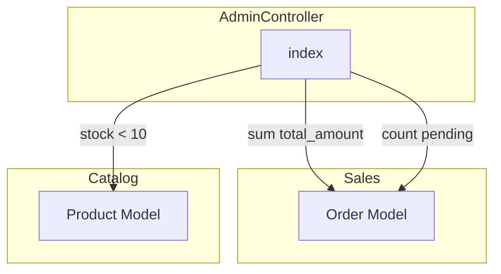

# Admin Dashboard Implementation
Implementar o módulo Admin (Dashboard Mestre) com métricas dinâmicas reais de vendas e estoque, integrando dados dos módulos Sales, Catalog e Inventory, usando o layout Core e seguindo os padrões UI/UX do sistema.


# Plano: Implementação Completa do Módulo Admin (Dashboard Illuminar)

## Contexto

O módulo Admin já existe com estrutura básica (AdminController, rotas resource, view placeholder). Será reescrito para exibir um dashboard profissional com dados reais dos módulos Sales, Catalog e Inventory. O layout Core (`x-core::layouts.master`) será utilizado em vez do layout próprio do Admin.

## Arquitetura de Dados




**Métricas a calcular:**

- **Vendas do Mês Atual**: `Order::whereMonth/year(created_at)->whereIn(status, ['paid','shipped'])->sum('total_amount')`
- **Vendas de Hoje**: `Order::whereDate(created_at, today())->sum('total_amount')` e `->count()`
- **Pedidos Pendentes**: `Order::where('status','pending')->count()`
- **Estoque Baixo**: `Product::where('stock','<',10)->orderBy('stock')->limit(5)->get()`
- **Últimos Pedidos**: `Order::with(['customer','user'])->orderByDesc('created_at')->limit(5)->get()`

**Nota:** `total_amount` no Order está em centavos (integer). Usar `UtilsHelper::formatMoneyToDisplay($value / 100)` para exibição.

---

## 1. Backend: AdminController

**Arquivo:** [Modules/Admin/app/Http/Controllers/AdminController.php](Modules/Admin/app/Http/Controllers/AdminController.php)

- Remover métodos `create`, `store`, `show`, `edit`, `update`, `destroy` (não usados no dashboard).
- Reescrever `index()`:
  - Importar `Modules\Sales\Models\Order`, `Modules\Catalog\Models\Product`, `Modules\Core\Helpers\UtilsHelper`, `Carbon\Carbon`.
  - Calcular `$monthlySales` (soma de `total_amount` de pedidos do mês atual com status `paid` ou `shipped`).
  - Calcular `$todaySales` (soma) e `$todayOrdersCount` (contagem) para pedidos de hoje.
  - Calcular `$pendingOrdersCount` (pedidos com status `pending`).
  - Buscar `$lowStockProducts` (5 produtos com `stock < 10`, ordenados por `stock` asc).
  - Buscar `$recentOrders` (últimos 5 pedidos com `customer` e `user`).
  - Formatar valores monetários com `UtilsHelper::formatMoneyToDisplay()` antes de enviar à view.
  - Retornar `view('admin::index', compact(...))`.

---

## 2. Rotas e Redirecionamento

**Arquivo:** [Modules/Admin/routes/web.php](Modules/Admin/routes/web.php)

- Substituir `Route::resource(...)` por:

```php
  Route::middleware(['auth'])->group(function () {
      Route::get('admin', [AdminController::class, 'index'])->name('admin.index');
  });
  

```

**Arquivo:** [routes/web.php](routes/web.php) (raiz)

- Alterar o redirect da rota `/` de `core.index` para `admin.index` quando o usuário estiver logado:

```php
  return auth()->check() ? redirect()->route('admin.index') : redirect()->route('login');
  

```

---

## 3. Frontend: View do Dashboard

**Arquivo:** [Modules/Admin/resources/views/index.blade.php](Modules/Admin/resources/views/index.blade.php)

Usar `<x-core::layouts.master heading="Dashboard">` e implementar:

### 3.1 Grid de Top Cards (4 cartões)


| Card               | Ícone                        | Cor     | Variável                 |
| ------------------ | ---------------------------- | ------- | ------------------------ |
| Faturamento do Mês | `chart-pie` ou `sack-dollar` | Verde   | `$monthlySalesFormatted` |
| Faturamento Hoje   | `coins` ou `money-bill-wave` | Verde   | `$todaySalesFormatted`   |
| Pedidos Pendentes  | `clock` ou `hourglass-half`  | Amarelo | `$pendingOrdersCount`    |
| Pedidos Hoje       | `receipt` ou `list`          | Azul    | `$todayOrdersCount`      |


Estrutura de cada card: ícone à esquerda (com `text-`* para cor), título, valor em destaque. Usar `rounded-xl`, `border`, `bg-white dark:bg-surface`, `p-6`, grid responsivo `grid-cols-1 sm:grid-cols-2 lg:grid-cols-4`.

### 3.2 Corpo do Dashboard (Grid 2 colunas)

**Coluna Esquerda - Últimos Pedidos:**

- Tabela com colunas: Número do Pedido, Status (badge com cores por status), Valor.
- Badge de status: `pending` (amarelo), `paid` (verde), `canceled` (vermelho), `shipped` (azul).
- Usar `$order->total_formatted` (accessor do Order).
- Botão/link "Ver todos" apontando para `route('sales.orders.index')`.

**Coluna Direita - Alerta de Estoque Baixo:**

- Lista/tabela: Nome do produto, SKU, Quantidade (badge vermelha).
- Botão "Repor Estoque" apontando para `route('inventory.transactions.create')`.
- Mensagem amigável quando `$lowStockProducts` estiver vazio.

### 3.3 Padrões UI

- `<x-icon name="..." style="duotone" />` para todos os ícones.
- Classes Tailwind com variante `dark:` para dark mode.
- `font-display` para títulos (h2, h3).
- Cards com `rounded-xl border border-border dark:border-border`.

---

## 4. Navegação: Sidebar no Master

**Arquivo:** [Modules/Core/resources/views/layouts/master.blade.php](Modules/Core/resources/views/layouts/master.blade.php)

- Inserir o item **Dashboard** como **primeiro** item da navegação (antes de "Início"):

```blade
  @if (Route::has('admin.index'))
      <a href="{{ route('admin.index') }}" class="flex items-center gap-3 px-3 py-2 rounded-lg ...">
          <x-icon name="chart-pie" style="duotone" />
          <span>Dashboard</span>
      </a>
  @endif
  

```

- Manter o link "Início" existente (ou opcionalmente redirecioná-lo para `/admin`; o plano mantém ambos para clareza).

---

## 5. Arquivos Não Alterados

- O layout `Modules/Admin/resources/views/components/layouts/master.blade.php` permanece como está (não será usado pelo dashboard).
- Nenhuma migration ou model novo no Admin.
- Nenhuma alteração em Sales, Catalog ou Inventory além do consumo de seus dados.

---

## Resumo de Arquivos


| Arquivo                                                  | Ação                                          |
| -------------------------------------------------------- | --------------------------------------------- |
| `Modules/Admin/app/Http/Controllers/AdminController.php` | Reescrever `index()` com lógica de métricas   |
| `Modules/Admin/routes/web.php`                           | Trocar resource por GET /admin                |
| `Modules/Admin/resources/views/index.blade.php`          | Criar dashboard completo com cards e tabelas  |
| `routes/web.php` (raiz)                                  | Redirect `/` para `admin.index` quando logado |
| `Modules/Core/resources/views/layouts/master.blade.php`  | Adicionar menu Dashboard como primeiro item   |


