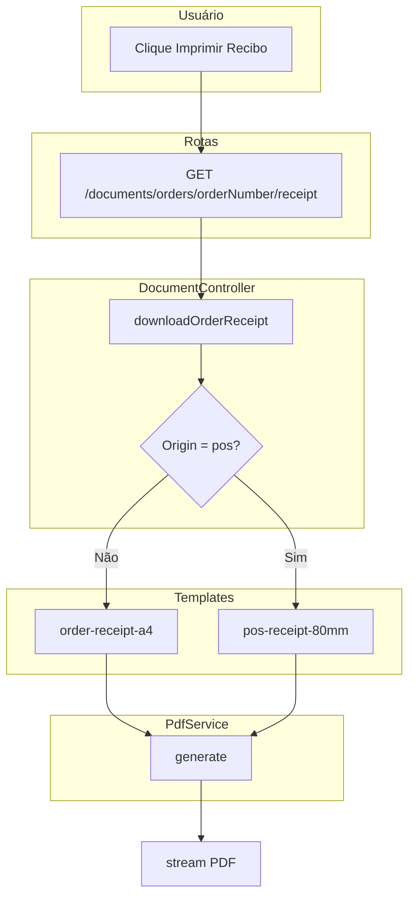

# Document Module PDF Implementation

Implementar o módulo Document como motor central de geração de PDFs, com PdfService, templates profissionais (recibo A4 e cupom 80mm), controller centralizado e integração nos painéis Sales e CustomerPanel.


# Plano: Módulo Document - Gerador de PDFs

## Contexto Técnico Validado

- **Stack:** Laravel 12, nwidart/laravel-modules
- **PDF:** `barryvdh/laravel-dompdf` — usar `Barryvdh\DomPDF\Facade\Pdf` (não `Facade`)
- **Order:** [Modules/Sales/app/Models/Order.php](Modules/Sales/app/Models/Order.php) — `origin` (`pos` | `storefront`), `items`, `customer`, `paymentGateway`; valores em centavos
- **UtilsHelper:** [Modules/Core/app/Helpers/UtilsHelper.php](Modules/Core/app/Helpers/UtilsHelper.php) — `formatMoneyToDisplay($value / 100)` para exibição
- **Views a alterar:** [Modules/Sales/resources/views/orders/show.blade.php](Modules/Sales/resources/views/orders/show.blade.php) (Admin/Sales) e [Modules/CustomerPanel/resources/views/orders/show.blade.php](Modules/CustomerPanel/resources/views/orders/show.blade.php)

---

## 1. Instalação e Configuração

### 1.1 Instalar DomPDF

```bash
composer require barryvdh/laravel-dompdf
```

(Assumir `yes` em confirmações)

### 1.2 PdfService

- **Criar:** `Modules/Document/app/Services/PdfService.php`
- **Método:** `generate(string $view, array $data, string $paperSize = 'a4', string $orientation = 'portrait')`
- Usar `Pdf::loadView($view, $data)` e encadear `->setPaper($paperSize, $orientation)` quando aplicável
- Retornar a instância do PDF (para `->stream()` ou `->download()` no controller)

### 1.3 Registrar PdfService

- No [DocumentServiceProvider](Modules/Document/app/Providers/DocumentServiceProvider.php), registrar o `PdfService` no container (singleton ou bind) para injeção no controller.

---

## 2. Templates de PDF (CSS Tradicional)

**Regra:** DOMPDF não suporta bem Flexbox, Grid ou Tailwind v4. Usar CSS tradicional (tabelas, `float`, `display: block`) e `<style>` inline ou em tag `<style>`.

### 2.1 `order-receipt-a4.blade.php`

- **Caminho:** `Modules/Document/resources/views/templates/order-receipt-a4.blade.php`
- **Conteúdo:**
  - Cabeçalho: logo/texto "ILLUMINAR" + dados fictícios (CNPJ, endereço)
  - Tabela: dados do cliente + número do pedido + data
  - Tabela de itens: Produto, Qtd, Preço Unitário, Subtotal (usar `UtilsHelper::formatMoneyToDisplay()`)
  - Resumo: Subtotal, Frete, Pagamento, Total Final
- **Variáveis:** `$order` (com `items`, `customer`, `paymentGateway`)

### 2.2 `pos-receipt-80mm.blade.php`

- **Caminho:** `Modules/Document/resources/views/templates/pos-receipt-80mm.blade.php`
- **Conteúdo:**
  - Largura ~80mm (280px)
  - Fonte monoespaçada, textos centralizados
  - Cabeçalho simples + listagem de itens (produto, qtd, subtotal)
  - Total final
- **Variáveis:** `$order`

---

## 3. DocumentController e Rota

### 3.1 Método `downloadOrderReceipt`

- **Arquivo:** [Modules/Document/app/Http/Controllers/DocumentController.php](Modules/Document/app/Http/Controllers/DocumentController.php)
- **Assinatura:** `downloadOrderReceipt(string $orderNumber)`
- **Lógica:**
  1. Buscar `Order::where('order_number', $orderNumber)->with(['items.product', 'customer', 'paymentGateway'])->firstOrFail()`
  2. **Autorização:** Se usuário tem role `Customer`, permitir apenas se `$order->customer_id === auth()->id()`. Caso contrário (staff), permitir qualquer pedido.
  3. Se `$order->origin === Order::ORIGIN_POS`: usar template `pos-receipt-80mm`, paper size `[0, 0, 226.77, 1000]` (80mm dinâmico)
  4. Caso contrário: usar template `order-receipt-a4`, paper A4 portrait
  5. Chamar `PdfService::generate()` e retornar `$pdf->stream('recibo-' . $orderNumber . '.pdf')`

### 3.2 Rota

- **Arquivo:** [Modules/Document/routes/web.php](Modules/Document/routes/web.php)
- **Rota:** `GET /documents/orders/{orderNumber}/receipt` → `document.order.receipt`
- **Middleware:** `auth` (e `verified` se desejado)
- **Nota:** Manter a rota resource existente ou ajustar conforme necessário para não conflitar.

---

## 4. Integração Visual nos Painéis

### 4.1 Sales (Admin)

- **Arquivo:** [Modules/Sales/resources/views/orders/show.blade.php](Modules/Sales/resources/views/orders/show.blade.php)
- **Alteração:** Trocar o `<button onclick="window.print()">` por um link:

```html
<a href="{{ route('document.order.receipt', $order->order_number) }}"
   target="_blank"
   class="inline-flex items-center gap-2 ...">
    <x-icon name="print" style="solid" class="w-4 h-4" />
    Imprimir Recibo
</a>
```

### 4.2 CustomerPanel

- **Arquivo:** [Modules/CustomerPanel/resources/views/orders/show.blade.php](Modules/CustomerPanel/resources/views/orders/show.blade.php)
- **Alteração:** Mesma troca do botão por link para `route('document.order.receipt', $order->order_number)` com `target="_blank"`.

---

## Diagrama de Fluxo




---

## Estrutura de Arquivos Final

```
Modules/Document/
├── app/
│   ├── Http/Controllers/
│   │   └── DocumentController.php  (atualizar + downloadOrderReceipt)
│   └── Services/
│       └── PdfService.php          (novo)
├── resources/views/templates/
│   ├── order-receipt-a4.blade.php  (novo)
│   └── pos-receipt-80mm.blade.php  (novo)
└── routes/
    └── web.php                     (adicionar rota document.order.receipt)
```

---

## Considerações de Segurança

- **Autorização:** Clientes só podem baixar recibo dos próprios pedidos (`customer_id === auth()->id()`).
- **Staff:** Roles como SuperAdmin, Owner, Gerente, Caixa podem acessar qualquer pedido.

---

## Dependências entre Módulos


| Módulo  | Uso no Document                       |
| ------- | ------------------------------------- |
| Sales   | Order, OrderItem                      |
| Core    | UtilsHelper                           |
| Payment | PaymentGateway (provider_label, etc.) |
| Catalog | Product (via OrderItem)               |
| User    | User (customer full_name)             |


