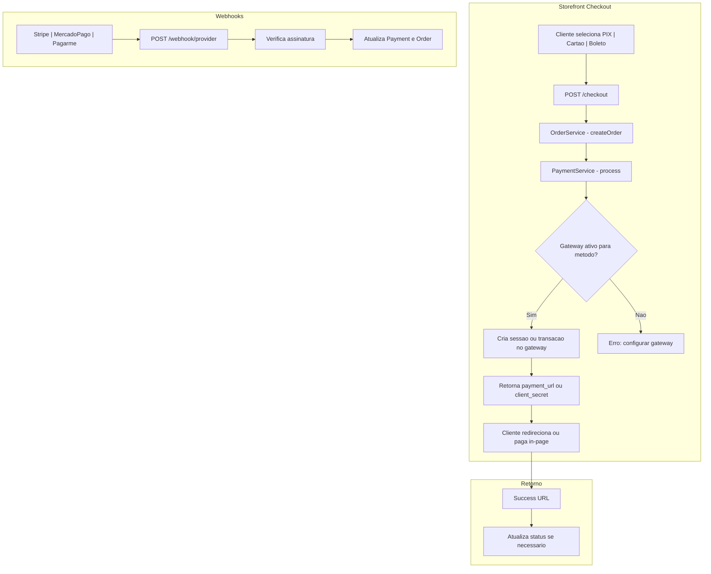

# Integração Gateways Pagamento
Implementar integração completa dos gateways Stripe, Mercado Pago e Pagar.me no fluxo de checkout do Storefront, com webhooks, tabela de pagamentos, seleção de gateway por método e suporte a PIX, cartão e boleto, seguindo as documentações oficiais.

# Integração Completa dos Gateways de Pagamento (Stripe, Mercado Pago, Pagar.me)

## Estado Atual

- **Payment**: `PaymentService` com métodos placeholder (sem API real), admin para configurar credenciais
- **Storefront**: Checkout cria pedido via `OrderService`, não chama nenhum gateway
- **Sales**: `Order` sem `payment_gateway_id`, `payment_status`, `transaction_id`; sem tabela `payments`
- **StorePanel (PDV)**: Pagamento em dinheiro marca `status=paid`; PIX/cartão no PDV permanecem como estão (sem gateway online)
- **CustomerPanel/Admin**: Exibem status do pedido; sem dados de pagamento externo

---

## Arquitetura Proposta

---

## Fase 1: Infraestrutura de Dados e SDKs

### 1.1 Dependências (composer.json)

Adicionar SDKs oficiais:

- `stripe/stripe-php` - [Stripe PHP](https://github.com/stripe/stripe-php)
- `mercadopago/dx-php` - [Mercado Pago PHP](https://github.com/mercadopago/dx-php)
- `pagarme/pagarme-php` - [Pagar.me PHP](https://github.com/pagarme/pagarme-php)

### 1.2 Migration: Tabela `payments`

Criar migration em `Modules/Payment/database/migrations/`:

- `order_id` (FK), `payment_gateway_id` (FK)
- `external_id` (id no gateway: pi_xxx, pref_xxx, tr_xxx)
- `status` (pending, processing, paid, failed, canceled)
- `amount` (centavos)
- `payment_method` (pix, credit_card, debit_card, boleto)
- `metadata` (JSON: qr_code, barcode, etc.)
- `paid_at` (nullable)

### 1.3 Migration: Ajustes em `orders`

- `payment_gateway_id` (nullable, FK)
- `payment_status` (nullable: pending, paid, failed, refunded)

### 1.4 Model `Payment`

- Relacionamentos: `order`, `paymentGateway`
- Scopes: `pending`, `paid`
- Métodos: `markAsPaid()`, `markAsFailed()`

---

## Fase 2: Configuração de Gateway por Método

### 2.1 Config no Admin

No admin de gateways (`[Modules/Payment/resources/views/admin/edit.blade.php](Modules/Payment/resources/views/admin/edit.blade.php)`), permitir marcar quais métodos cada gateway atende:

- Checkboxes: PIX, Cartão de Crédito, Cartão de Débito, Boleto
- Salvar em `credentials` ou em coluna `supported_methods` (JSON)

### 2.2 Serviço `GatewayResolver`

Criar `Modules/Payment/Services/GatewayResolver.php`:

- `resolveForMethod(string $paymentMethod): ?PaymentGateway`
- Busca gateway ativo que suporte o método
- Prioridade: primeiro ativo encontrado (ou ordem configurável)

---

## Fase 3: Implementação por Gateway

### 3.1 Stripe ([docs.stripe.com](https://docs.stripe.com/))

**Fluxo:** Checkout Session (redirect) – Stripe hospeda a página de pagamento.

- Criar `CheckoutSession` com `payment_method_types`: `card`, `pix`, `boleto` (BRL)
- `success_url`, `cancel_url` apontando para rotas do Storefront
- `metadata`: `order_id`, `order_number`
- Webhook: `checkout.session.completed` → marcar Payment e Order como paid

**Arquivos:** `PaymentService::processStripe()`, `StripeWebhookController`

### 3.2 Mercado Pago ([mercadopago.com.br/developers](https://www.mercadopago.com.br/developers/pt/docs))

**Fluxo:** Checkout Pro via Preferência (redirect).

- Usar `PreferenceClient` do SDK para criar preferência
- `items`, `payer` (email do cliente), `back_urls` (success, failure, pending)
- `payment_methods` para restringir a PIX, cartão, boleto
- Webhook: `payment` (approved) → atualizar Payment e Order

**Arquivos:** `PaymentService::processMercadoPago()`, `MercadoPagoWebhookController`

### 3.3 Pagar.me ([docs.pagar.me](https://docs.pagar.me/))

**Fluxo:** Transaction API – criar transação e obter URL de pagamento.

- `transactions()->create()` com `payment_method`, `amount`, `customer`
- PIX: retorna QR code / copia e cola
- Boleto: retorna URL do boleto
- Cartão: processar na hora ou tokenizar
- Webhook: `postback_url` (postback) → atualizar Payment e Order

**Arquivos:** `PaymentService::processPagarme()`, `PagarmeWebhookController`

---

## Fase 4: Integração no Checkout (Storefront)

### 4.1 StorefrontController::processCheckout

Alterar fluxo:

1. Validar itens, frete, `payment_method`
2. `OrderService::createOrder()` (status `pending`)
3. `GatewayResolver::resolveForMethod($payment_method)` → gateway
4. Se não houver gateway: retornar erro pedindo configuração
5. `PaymentService::process($order, $gateway)` com `payment_method`
6. Persistir `Payment` com `external_id`, `status=pending`
7. Atualizar `Order`: `payment_gateway_id`, `payment_status=pending`
8. Resposta JSON: `payment_url` (redirect) ou `client_secret` (embedded, se aplicável)

### 4.2 Frontend (checkout.blade.php)

- Se `payment_url`: `window.location.href = payment_url`
- Se `client_secret` (Stripe Elements): renderizar formulário de cartão in-page (opcional, fase posterior)
- Para PIX/Boleto: sempre redirect

### 4.3 Rotas de Retorno

- `GET /checkout/success?session_id=xxx` (Stripe) ou `?order=xxx` (MP/Pagarme)
- `GET /checkout/cancel?order=xxx`
- Controller: verificar sessão/order, exibir confirmação e link para "Meus Pedidos"

---

## Fase 5: Webhooks

### 5.1 Rotas (sem CSRF, com verificação de assinatura)

- `POST /webhook/stripe` → `StripeWebhookController`
- `POST /webhook/mercadopago` → `MercadoPagoWebhookController`
- `POST /webhook/pagarme` → `PagarmeWebhookController`

### 5.2 Verificação de Assinatura

- **Stripe:** `Stripe::constructEvent($payload, $sig, $webhook_secret)`
- **Mercado Pago:** validar `x-signature` conforme [docs](https://www.mercadopago.com.br/developers/pt/docs/your-integrations/notifications/webhooks)
- **Pagar.me:** validar assinatura do postback

### 5.3 Handlers

- Buscar `Payment` por `external_id`
- Atualizar `Payment.status = paid`, `Payment.paid_at`
- Atualizar `Order.status = paid`, `Order.payment_status = paid`

---

## Fase 6: OrderService e Módulos Relacionados

### 6.1 OrderService

- Aceitar `payment_gateway_id` em `$data` (quando disponível após resolver gateway)
- Manter compatibilidade com PDV (cash = paid, sem gateway)

### 6.2 StorePanel (PDV)

- Manter fluxo atual: `cash` → `status=paid` imediato
- PIX/cartão no PDV: continuar como `pending` ou integrar com maquininha (fora do escopo inicial)

### 6.3 CustomerPanel

- Exibir `payment_status` na listagem e na página do pedido
- Para pedidos `pending` com PIX: exibir QR/código se disponível em `Payment.metadata` (opcional)

### 6.4 Admin (Sales)

- Listagem de pedidos: coluna `payment_status`
- Detalhe do pedido: dados do `Payment` (external_id, status, gateway)

---

## Fase 7: Admin – Configuração de Métodos por Gateway

### 7.1 PaymentGateway

- Adicionar lógica para `supported_methods`: array em `credentials` ou coluna dedicada
- Ex.: `['pix', 'credit_card', 'boleto']`

### 7.2 AdminPaymentGatewayController

- Validar e salvar `supported_methods` no update
- Na criação de gateway, definir métodos padrão conforme provider

---

## Resumo de Arquivos Principais

| Módulo        | Arquivo                                                  | Ação                                      |
| ------------- | -------------------------------------------------------- | ----------------------------------------- |
| Payment       | `database/migrations/*_create_payments_table.php`        | Criar                                     |
| Payment       | `database/migrations/*_add_payment_fields_to_orders.php` | Criar                                     |
| Payment       | `app/Models/Payment.php`                                 | Criar                                     |
| Payment       | `app/Services/GatewayResolver.php`                       | Criar                                     |
| Payment       | `app/Services/PaymentService.php`                        | Reescrever métodos por provider           |
| Payment       | `app/Http/Controllers/StripeWebhookController.php`       | Criar                                     |
| Payment       | `app/Http/Controllers/MercadoPagoWebhookController.php`  | Criar                                     |
| Payment       | `app/Http/Controllers/PagarmeWebhookController.php`      | Criar                                     |
| Payment       | `app/Http/Controllers/CheckoutReturnController.php`      | Criar (success/cancel)                    |
| Payment       | `routes/web.php`                                         | Rotas webhook e return                    |
| Storefront    | `app/Http/Controllers/StorefrontController.php`          | Integrar PaymentService e GatewayResolver |
| Storefront    | `resources/views/checkout.blade.php`                     | Redirect para payment_url                 |
| Storefront    | `routes/web.php`                                         | Rotas success/cancel                      |
| Sales         | `app/Models/Order.php`                                   | Novos campos e relacionamentos            |
| Sales         | `app/Services/OrderService.php`                          | Aceitar payment_gateway_id                |
| Sales         | `database/migrations/*_add_payment_to_orders.php`        | Incluído na Fase 1                        |
| Admin         | `resources/views/orders/show.blade.php`                  | Exibir payment_status e Payment           |
| CustomerPanel | `resources/views/orders/show.blade.php`                  | Exibir payment_status                     |

---

## Considerações de Segurança

- Webhooks: validar assinatura antes de processar
- Credenciais: manter `encrypted:array` no model
- URLs de webhook: usar HTTPS em produção
- Logs: registrar erros de webhook sem expor dados sensíveis

---

## Ordem de Implementação Sugerida

1. Fase 1 (migrations, Payment model, SDKs)
2. Fase 2 (GatewayResolver, supported_methods)
3. Fase 3.1 – Stripe (mais documentado e estável)
4. Fase 4 (checkout Storefront + redirect)
5. Fase 5.1 – Webhook Stripe
6. Fase 3.2 e 3.3 – Mercado Pago e Pagar.me
7. Fase 5.2 e 5.3 – Webhooks MP e Pagarme
8. Fase 6 e 7 – Ajustes em Order, Admin, CustomerPanel

