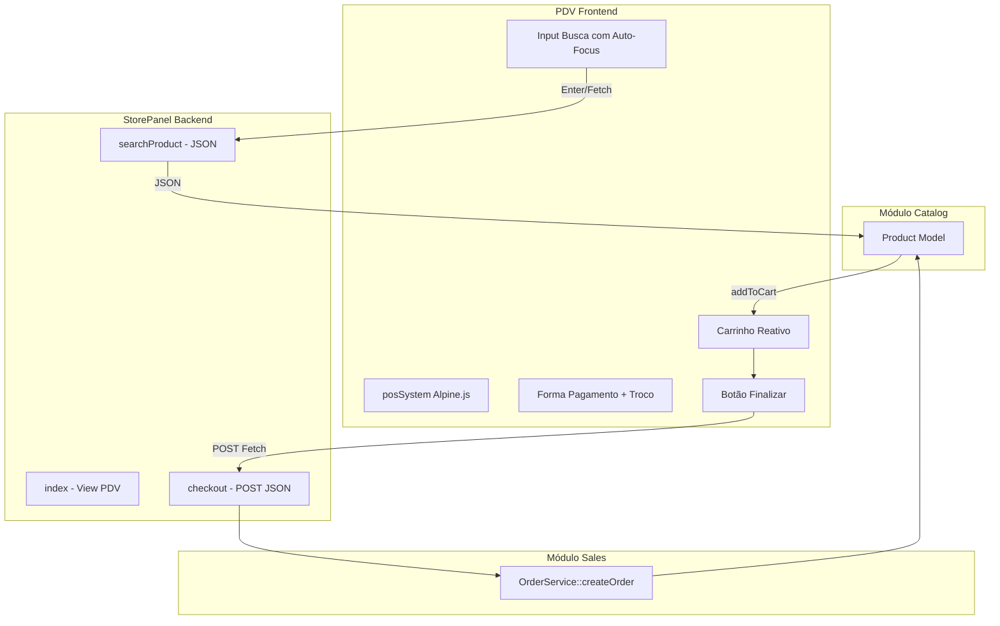

### StorePanel PDV Implementation
overview: "Implementar o módulo StorePanel (PDV) completo: backend com StorePanelController (searchProduct, checkout), layout dedicado sem sidebar, view SPA reativa com Alpine.js, integração com OrderService e botão \"Abrir PDV\" no layout master."


# Plano: Implementação Completa do Módulo StorePanel (PDV)

## Arquitetura Geral




---

## 1. Backend: StorePanelController e Rotas

### 1.1 Refatorar [Modules/StorePanel/app/Http/Controllers/StorePanelController.php](Modules/StorePanel/app/Http/Controllers/StorePanelController.php)

Substituir o controller atual por:

- `**index()**`: Retorna `view('storepanel::pos.index')` - tela principal do PDV.
- `**searchProduct(Request $request)**`: 
  - Valida `term` (required, string).
  - Busca: `Product::where('barcode', $term)->orWhere('sku', $term)->first()`.
  - Se não encontrar: `abort(404)` ou retorno JSON `{ error: 'Produto não encontrado' }`.
  - Se encontrar: retorna JSON com `id`, `name`, `sku`, `barcode`, `price` (centavos), `price_formatted`, `stock`, `voltage`, `power_watts`, `lumens`, `color_temperature_k`.
- `**checkout(Request $request)**`:
  - Valida: `items` (array de `{ product_id, quantity }`), `payment_method` (in: pix, credit_card, debit_card, cash).
  - Se `payment_method === 'cash'`, validar `amount_received` (opcional para troco).
  - Instancia `OrderService` e chama `createOrder()` com:
    - `$data`: `origin => 'pos'`, `customer_id => null`, `payment_method`, `user_id => auth()->id()`.
    - `$items`: array do request.
  - Retorna JSON `{ success: true, order_number: '...' }`.
  - Em caso de exceção (estoque insuficiente): retorna JSON 422 com mensagem.

### 1.2 Rotas em [Modules/StorePanel/routes/web.php](Modules/StorePanel/routes/web.php)

```php
Route::middleware(['auth', 'verified'])->prefix('pdv')->name('pdv.')->group(function () {
    Route::get('/', [StorePanelController::class, 'index'])->name('index');
    Route::get('/search', [StorePanelController::class, 'searchProduct'])->name('search');
    Route::post('/checkout', [StorePanelController::class, 'checkout'])->name('checkout');
});
```

---

## 2. Layout Dedicado do PDV

### 2.1 Criar [Modules/StorePanel/resources/views/layouts/pos.blade.php](Modules/StorePanel/resources/views/layouts/pos.blade.php)

Layout minimalista em tela cheia, sem sidebar:

- Estrutura: `h-screen flex flex-col` (full viewport).
- Incluir: `@vite`, `x-loading-overlay`, meta CSRF.
- Suporte a dark mode (Alpine `x-data` com `darkMode`).
- Body: `{{ $slot }}` para o conteúdo do PDV.
- Sem sidebar, sem topbar complexa - apenas o slot.

---

## 3. View Principal do PDV

### 3.1 Criar [Modules/StorePanel/resources/views/pos/index.blade.php](Modules/StorePanel/resources/views/pos/index.blade.php)

Usa layout `storepanel::layouts.pos`. Estrutura em Grid de duas colunas:

**Coluna Esquerda (Carrinho - ~60%):**

- Tabela com: Produto (nome, SKU), Qtd (botões +/- e input), Preço unit., Subtotal.
- Botão remover por linha.
- Área vazia quando carrinho vazio.

**Coluna Direita (Comandos - ~40%):**

- Input de busca com `x-ref="searchInput"` e `@keydown.enter.prevent="search()"`.
- Resumo: Subtotal, Desconto (0 por padrão), Total.
- Select forma de pagamento: PIX, Cartão Crédito, Cartão Débito, Dinheiro.
- Se Dinheiro: input "Valor Recebido" com `x-mask="'money'"` e exibição do Troco.
- Botão gigante verde "Finalizar Venda".

---

## 4. Alpine.js: Componente `posSystem()`

### 4.1 Registrar em `Alpine.data('posSystem', ...)` ou inline `x-data="posSystem()"`

**Estado:**

- `cart: []` (array de `{ product_id, name, sku, price, quantity, subtotal }`).
- `searchTerm: ''`.
- `paymentMethod: 'pix'`.
- `amountReceived: ''`.
- `loading: false`.
- `toast: { show: false, message: '', type: 'error' }`.

**Métodos:**

- `init()`: 
  - `$nextTick` para focar `$refs.searchInput`.
  - `setInterval` ou `MutationObserver` para manter foco no input (exceto quando clicar em outros campos).
  - `document.addEventListener('keydown', ...)`: F2 chama `checkout()`, F4 chama `cancelSale()` (limpa carrinho).
- `search()`: Fetch GET `/pdv/search?term=...`. Se 200, `addToCart(product)`, limpa input, foca novamente. Se 404, mostra toast de erro.
- `addToCart(product)`: Se já existe (por product_id), incrementa qty. Senão, push novo item. Recalcula subtotais.
- `removeFromCart(index)`: `cart.splice(index, 1)`.
- `updateQuantity(index, qty)`: Atualiza e recalcula. Se qty <= 0, remove.
- `checkout()`: Valida carrinho não vazio. Dispara `start-loading`. POST `/pdv/checkout` com `{ items, payment_method, amount_received }`. Em sucesso: toast sucesso, limpa carrinho, reseta, dispara `stop-loading`. Em erro: toast erro, `stop-loading`.

**Getters (Alpine `get`):**

- `cartTotal`: soma de `item.subtotal` do carrinho.
- `changeAmount`: se `paymentMethod === 'cash'` e `amountReceived` preenchido, retorna `parseFloat(amountReceived) - (cartTotal/100)`; senão 0.

---

## 5. Toast de Erro/Sucesso

Implementar toast simples com Alpine na própria view:

- `x-show="toast.show"` com `x-transition`.
- Exibir `toast.message` e cor conforme `toast.type` (success/error).
- Auto-hide após 3s com `setTimeout`.

---

## 6. Integração no Layout Master

### 6.1 Editar [Modules/Core/resources/views/layouts/master.blade.php](Modules/Core/resources/views/layouts/master.blade.php)

No header (topbar), adicionar botão "Abrir PDV" ao lado do título:

```blade
@if (Route::has('pdv.index'))
    <a href="{{ route('pdv.index') }}" target="_blank"
       class="inline-flex items-center gap-2 rounded-lg bg-green-600 px-4 py-2 text-sm font-medium text-white hover:bg-green-700">
        <x-icon name="cash-register" style="duotone" class="w-5 h-5" />
        Abrir PDV
    </a>
@endif
```

Posicionar no topbar (ex.: à direita, antes do botão de tema no mobile).

---

## 7. Detalhes Técnicos

### 7.1 Formato do Carrinho (Frontend)

Cada item: `{ product_id, name, sku, price (centavos), quantity, subtotal (price * quantity) }`.

### 7.2 Payload do Checkout (POST)

```json
{
  "items": [{"product_id": 1, "quantity": 2}, ...],
  "payment_method": "pix",
  "amount_received": "150.00"  // apenas se cash, string formatada
}
```

### 7.3 Resposta do searchProduct

```json
{
  "id": 1,
  "name": "Lâmpada LED",
  "sku": "LAMP-001",
  "barcode": "789123",
  "price": 2500,
  "price_formatted": "R$ 25,00",
  "stock": 50,
  "voltage": "Bivolt",
  "power_watts": 9.5,
  "lumens": 800,
  "color_temperature_k": 4000
}
```

### 7.4 Auto-focus para Leitor de Código de Barras

- Input de busca com `autofocus` e `tabindex` adequado.
- Após cada `search()` ou `addToCart`, chamar `$refs.searchInput.focus()`.
- Listener de `keydown` global: ao pressionar F2, prevenir default e chamar checkout.

---

## 8. Arquivos a Criar/Modificar


| Ação       | Arquivo                                                            |
| ---------- | ------------------------------------------------------------------ |
| Reescrever | `Modules/StorePanel/app/Http/Controllers/StorePanelController.php` |
| Reescrever | `Modules/StorePanel/routes/web.php`                                |
| Criar      | `Modules/StorePanel/resources/views/layouts/pos.blade.php`         |
| Criar      | `Modules/StorePanel/resources/views/pos/index.blade.php`           |
| Editar     | `Modules/Core/resources/views/layouts/master.blade.php`            |


---

## 9. Ordem de Execução

1. Criar layout `pos.blade.php`.
2. Reescrever `StorePanelController` com `index`, `searchProduct`, `checkout`.
3. Atualizar rotas em `web.php`.
4. Criar view `pos/index.blade.php` com estrutura HTML e Alpine.js completo.
5. Adicionar botão "Abrir PDV" no master.

