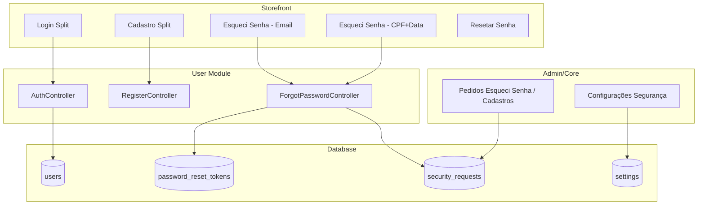

# Auth Split Design Security

Redesenhar login, cadastro e recuperação de senha com layout split, suporte a login por email ou CPF, recuperação por email ou CPF+data de nascimento, e adicionar painel admin para gerenciar solicitações e configurar reCAPTCHA v3, 2FA e outros métodos de segurança.


# Plano: Auth Split Design, Recuperação de Senha e Configurações de Segurança

## 1. Visão Geral da Arquitetura




---

## 2. Layout Split e Design

### 2.1 Novo layout auth split

Criar layout dedicado para páginas de autenticação (login, cadastro, esqueci senha, resetar senha) com:

- **Estrutura split:** Coluna esquerda (50%) com branding visual (gradiente amber, ícones lightbulb/bolt, slogan); coluna direita (50%) com formulário.
- **Logo oficial:** `<x-core::logo />` no topo da coluna esquerda ou centralizado; **clicável** apontando para `route('storefront.index')`.
- **Responsivo:** Em mobile, coluna esquerda reduzida ou oculta; formulário em full-width.
- **Estilo:** Mesma linguagem da home: `rounded-2xl`, `border-amber-500/20`, `bg-gradient-to-r from-amber-500 to-amber-600`, `font-display`, ícones duotone.

**Arquivo:** [Modules/Core/resources/views/layouts/auth-split.blade.php](Modules/Core/resources/views/layouts/auth-split.blade.php) (novo)

### 2.2 Páginas que usarão o layout


| Página                | Rota                       | Layout     |
| --------------------- | -------------------------- | ---------- |
| Login                 | `/login`                   | auth-split |
| Cadastro              | `/cadastro`                | auth-split |
| Esqueci senha (email) | `/esqueci-senha`           | auth-split |
| Esqueci senha (CPF)   | `/esqueci-senha/cpf`       | auth-split |
| Resetar senha         | `/redefinir-senha/{token}` | auth-split |


---

## 3. Login por Email ou CPF

### 3.1 UI com abas

- **Aba "E-mail":** Campo email + senha + lembrar-me.
- **Aba "CPF":** Campo CPF (com `x-mask="'cpf'"`) + senha + lembrar-me.
- Tabs com Alpine.js (`x-data="{ tab: 'email' }"`); formulário único com campos condicionais.

### 3.2 Lógica no AuthController

- Validar `login_type` (email ou cpf) + `email` ou `cpf` + `password`.
- Se CPF: normalizar com `UtilsHelper::onlyDigits()`, buscar usuário por `document` ou `cpf` onde `document_type = 'cpf'`.
- Se email: manter fluxo atual `Auth::attempt(['email' => ..., 'password' => ...])`.
- Para login por CPF: usar `Auth::attempt` com credenciais customizadas; será necessário um **custom User Provider** ou resolver o user manualmente e usar `Auth::login($user, $remember)`.

**Arquivos:**

- [Modules/User/resources/views/auth/login.blade.php](Modules/User/resources/views/auth/login.blade.php) – refatorar com split + tabs
- [Modules/User/app/Http/Controllers/AuthController.php](Modules/User/app/Http/Controllers/AuthController.php) – suportar `login_type`, `cpf`, `email`

---

## 4. Esqueci a Senha

### 4.1 Por E-mail (padrão Laravel)

- Rota `GET /esqueci-senha` → formulário com campo email.
- Rota `POST /esqueci-senha` → `Password::sendResetLink()`.
- Rota `GET /redefinir-senha/{token}` → formulário nova senha.
- Rota `POST /redefinir-senha` → `Password::reset()`.
- Usar `Illuminate\Auth\Passwords\PasswordBroker` e tabela `password_reset_tokens`.
- **Registrar solicitação** na tabela `security_requests` para admin.

### 4.2 Por CPF + Data de Nascimento

- Rota `GET /esqueci-senha/cpf` → formulário CPF + data de nascimento.
- Rota `POST /esqueci-senha/cpf` → validar CPF + `birth_date` contra `users`; se OK, gerar token e enviar link de reset por email (ou redirecionar para `/redefinir-senha/{token}` com token na query).
- Fluxo: verificar identidade → criar entrada em `password_reset_tokens` com email do usuário → enviar email com link de reset (reutilizando notificação Laravel).
- **Registrar solicitação** em `security_requests`.

### 4.3 Tabela `security_requests`

Armazenar todas as solicitações para o admin visualizar:


| Campo                  | Tipo       | Descrição                                                          |
| ---------------------- | ---------- | ------------------------------------------------------------------ |
| id                     | bigint     | PK                                                                 |
| type                   | enum       | `password_reset_email`, `password_reset_cpf`, `registration`, etc. |
| user_id                | nullable   | FK users                                                           |
| email                  | nullable   | Email usado                                                        |
| cpf                    | nullable   | CPF usado (mascarado em listagem)                                  |
| ip_address             | string     | IP do solicitante                                                  |
| user_agent             | text       | User-Agent                                                         |
| status                 | enum       | `pending`, `completed`, `expired`, `failed`                        |
| metadata               | json       | Dados extras                                                       |
| created_at, updated_at | timestamps |                                                                    |


**Migration:** `Modules/Core/database/migrations/xxxx_create_security_requests_table.php`

---

## 5. Página de Cadastro

### 5.1 Formulário

Campos: `first_name`, `last_name`, `email`, `cpf`, `phone`, `birth_date`, `password`, `password_confirmation`, `newsletter` (opcional), termos de uso.

- CPF com `x-mask="'cpf'"`, phone com `x-mask` se existir.
- Validação: email único, CPF único (document/cpf), senha forte.
- Após cadastro: `User` com `role = Customer`, `status = active` (ou `pending_verification` se quiser aprovação); redirect para login ou painel.

### 5.2 Rotas e Controller

- `GET /cadastro` → `RegisterController@showRegistrationForm`
- `POST /cadastro` → `RegisterController@register`
- Registrar em `security_requests` com `type = 'registration'`.

**Arquivos:**

- [Modules/User/app/Http/Controllers/RegisterController.php](Modules/User/app/Http/Controllers/RegisterController.php) (novo)
- [Modules/User/resources/views/auth/register.blade.php](Modules/User/resources/views/auth/register.blade.php) (novo)

---

## 6. Logo Clicável e Navegação

- Em todas as páginas auth (login, cadastro, esqueci senha, resetar senha): logo com `<a href="{{ route('storefront.index') }}">`.
- Link "Voltar" ou "Continuar comprando" apontando para home quando fizer sentido.

---

## 7. Admin: Gerenciamento de Solicitações

### 7.1 Listagem de Pedidos (Esqueci Senha, Cadastros)

- Nova seção no sidebar do admin (Configurações ou nova "Segurança"): "Solicitações de Conta".
- Rota: `GET /admin/security-requests` (ou dentro do Core).
- Listagem com filtros: tipo (`password_reset_email`, `password_reset_cpf`, `registration`), status, data.
- Colunas: Tipo, Email/CPF (mascarado), IP, Status, Data.
- Apenas SuperAdmin/Owner.

**Arquivos:**

- Controller: `Modules/Admin` ou `Modules/Core` – `SecurityRequestController`
- View: listagem em tabela
- Model: `SecurityRequest` em Core ou User

---

## 8. Admin: Configurações de Segurança

### 8.1 Tabela `settings`

Armazenar configurações globais em key-value:


| Campo                  | Tipo                              |
| ---------------------- | --------------------------------- |
| id                     | bigint                            |
| key                    | string (unique)                   |
| value                  | text (json ou string)             |
| type                   | enum: `string`, `json`, `boolean` |
| group                  | string (ex: `security`)           |
| created_at, updated_at | timestamps                        |


**Migration:** `Modules/Core/database/migrations/xxxx_create_settings_table.php`

### 8.2 Chaves de segurança (exemplos)


| Key                                | Descrição                             | Tipo        |
| ---------------------------------- | ------------------------------------- | ----------- |
| `security.recaptcha_v3_site_key`   | reCAPTCHA v3 Site Key                 | string      |
| `security.recaptcha_v3_secret_key` | reCAPTCHA v3 Secret Key               | string      |
| `security.recaptcha_enabled`       | Habilitar reCAPTCHA em login/register | boolean     |
| `security.two_factor_enabled`      | Habilitar 2FA (futuro)                | boolean     |
| `security.login_attempts_max`      | Máx. tentativas de login              | json/number |


### 8.3 UI no Admin

- Nova página: "Configurações de Segurança" em Configurações (sidebar).
- Rota: `GET /admin/settings/security`, `PUT /admin/settings/security`.
- Formulário: reCAPTCHA v3 (site key, secret key, checkbox habilitar), 2FA (checkbox habilitar), outros conforme necessidade.
- Model `Setting` com métodos `get($key)`, `set($key, $value)`; valores sensíveis (secret key) com `encrypted` cast ou crypt.

**Arquivos:**

- `Modules/Core/Models/Setting.php` (ou `Modules/Admin`)
- `Modules/Admin/Http/Controllers/SettingsController.php` ou `SecuritySettingsController`
- View: `admin/settings/security.blade.php`
- Atualizar [Modules/Core/resources/views/layouts/master.blade.php](Modules/Core/resources/views/layouts/master.blade.php) – link "Segurança" em Configurações

### 8.4 Integração reCAPTCHA v3

- Incluir script do reCAPTCHA v3 nas páginas de login, cadastro e esqueci senha quando `security.recaptcha_enabled = true`.
- No submit: obter token via `grecaptcha.execute()`, enviar no request.
- Backend: validar token com Google API usando secret key; rejeitar se score baixo ou inválido.

---

## 9. Rotas (User Module)

```php
// Públicas (guest)
Route::get('login', ...)->name('login');
Route::post('login', ...);
Route::get('cadastro', ...)->name('register');
Route::post('cadastro', ...);
Route::get('esqueci-senha', ...)->name('password.request');
Route::post('esqueci-senha', ...)->name('password.email');
Route::get('esqueci-senha/cpf', ...)->name('password.request.cpf');
Route::post('esqueci-senha/cpf', ...)->name('password.email.cpf');
Route::get('redefinir-senha/{token}', ...)->name('password.reset');
Route::post('redefinir-senha', ...)->name('password.update');
Route::post('logout', ...)->name('logout');
```

---

## 10. Resumo de Arquivos


| Ação      | Arquivo                                                                 |
| --------- | ----------------------------------------------------------------------- |
| Criar     | `Modules/Core/resources/views/layouts/auth-split.blade.php`             |
| Modificar | `Modules/User/resources/views/auth/login.blade.php`                     |
| Criar     | `Modules/User/resources/views/auth/register.blade.php`                  |
| Criar     | `Modules/User/resources/views/auth/forgot-password.blade.php`           |
| Criar     | `Modules/User/resources/views/auth/forgot-password-cpf.blade.php`       |
| Criar     | `Modules/User/resources/views/auth/reset-password.blade.php`            |
| Modificar | `Modules/User/app/Http/Controllers/AuthController.php`                  |
| Criar     | `Modules/User/app/Http/Controllers/RegisterController.php`              |
| Criar     | `Modules/User/app/Http/Controllers/ForgotPasswordController.php`        |
| Modificar | `Modules/User/routes/web.php`                                           |
| Criar     | Migration `create_security_requests_table`                              |
| Criar     | Migration `create_settings_table`                                       |
| Criar     | Model `SecurityRequest`                                                 |
| Criar     | Model `Setting`                                                         |
| Criar     | `SecurityRequestController` (Admin)                                     |
| Criar     | `SecuritySettingsController` (Admin)                                    |
| Criar     | Views admin: security-requests, settings/security                       |
| Modificar | `Modules/Core/resources/views/layouts/master.blade.php` (links sidebar) |
| Registrar | Componente `auth-split` no CoreServiceProvider (se necessário)          |


---

## 11. Ordem de Implementação Sugerida

1. Migrations: `settings`, `security_requests`
2. Models: `Setting`, `SecurityRequest`
3. Layout `auth-split` e logo clicável
4. Login refatorado (split + tabs email/CPF)
5. Rotas e controllers: forgot password (email + CPF), reset password
6. Página de cadastro
7. Admin: listagem security_requests
8. Admin: configurações de segurança (reCAPTCHA, 2FA)
9. Integração reCAPTCHA v3 nas páginas auth
10. Atualizar `meus-pedidos.blade.php` para usar `route('register')` (já existe; garantir que a rota esteja definida)

