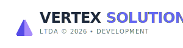

<p align="center">
  
</p>

<h1 align="center">Illuminar</h1>
<p align="center">
  <strong>MATERIAIS ELÉTRICOS E ILUMINAÇÃO</strong>
</p>
<p align="center">
  Sistema corporativo modular de E-commerce e PDV para lojas de iluminação
</p>

<p align="center">
  
  
  
  
</p>

---

## 📋 Índice

- [Sobre o Projeto](#-sobre-o-projeto)
- [Funcionalidades](#-funcionalidades)
- [Stack Tecnológica](#-stack-tecnológica)
- [Módulos do Sistema](#-módulos-do-sistema)
- [Requisitos](#-requisitos)
- [Instalação](#-instalação)
- [Desenvolvimento](#-desenvolvimento)
- [Estrutura do Projeto](#-estrutura-do-projeto)
- [Equipe](#-equipe)
- [Licença](#-licença)

---

## 🏢 Sobre o Projeto

O **Illuminar** é uma plataforma completa de E-commerce e Ponto de Venda (PDV) desenvolvida especificamente para o segmento de **materiais elétricos e iluminação**. O sistema une vendas presenciais (balcão com leitor de código de barras) e vendas online em uma única base de dados, com gestão integrada de catálogo, estoque, pedidos e financeiro.

### Diferenciais

- **Arquitetura modular** — 9 módulos independentes e reutilizáveis
- **Foco no segmento** — Campos técnicos específicos: voltagem, potência (W), temperatura de cor (K), lúmens
- **PDV ultra-rápido** — Interface reativa com Alpine.js, leitura de código de barras e atalhos de teclado
- **E-commerce integrado** — Vitrine online, carrinho, checkout e painel do cliente
- **Dark mode nativo** — Interface adaptável com suporte a tema claro/escuro

---

## ✨ Funcionalidades

| Área | Recursos |
|------|----------|
| **Catálogo** | Produtos com especificações técnicas, categorias, marcas, busca e filtros avançados |
| **Estoque** | Entradas, saídas, fornecedores, Kardex e controle rigoroso separado do catálogo |
| **Vendas** | Pedidos unificados (PDV + online), status, rastreamento, métodos de pagamento |
| **PDV** | Leitor de código de barras, atalhos (F2/F4), fechamento via AJAX sem recarregar |
| **Admin** | Dashboard com gráficos, curva ABC, relatórios de lucro, configurações globais |
| **Loja Virtual** | Homepage, vitrine, carrinho reativo, checkout em etapas, área institucional |
| **Cliente** | Histórico de pedidos, rastreamento, download de NF, edição de perfil |
| **Usuários** | CRUD completo, papéis (Dono, Gerente, Caixa, Cliente), permissões via Spatie |

---

## 🛠 Stack Tecnológica

| Camada | Tecnologia |
|--------|------------|
| **Backend** | Laravel 12, PHP 8.2+ |
| **Módulos** | nwidart/laravel-modules |
| **Permissões** | spatie/laravel-permission |
| **Frontend** | Blade, Tailwind CSS v4.1, Alpine.js v3.15 |
| **Máscaras** | IMask (CPF, CNPJ, telefone, moeda, data) |
| **Ícones** | Font Awesome Pro 7.1.0 |
| **Tipografia** | Inter (UI), Poppins (títulos) |
| **Build** | Vite 7 |

> ⚠️ **Proibições:** Nenhum Livewire, React ou Vue.js no frontend.

---

## 📦 Módulos do Sistema

| Módulo | Descrição |
|--------|-----------|
| **Core** | Base da aplicação: layouts, `<x-loading-overlay>`, `<x-icon>`, Tailwind, Alpine.js, helpers e middlewares |
| **User** | Gerenciamento de usuários e permissões com Spatie Permission (Dono, Gerente, Caixa, Cliente) |
| **Catalog** | Gestão de produtos, categorias e marcas com campos técnicos do segmento de iluminação |
| **Inventory** | Controle de estoque, fornecedores, entradas/saídas e relatório Kardex |
| **Sales** | Motor central de pedidos, pagamentos, status e rastreamento (PDV + e-commerce) |
| **StorePanel** | Ponto de Venda presencial com código de barras e atalhos de teclado |
| **Admin** | Dashboard, gráficos, relatórios, curva ABC e configurações globais |
| **Storefront** | Vitrine online, carrinho, checkout e área institucional |
| **CustomerPanel** | Painel do cliente: pedidos, rastreamento, NF e perfil |

---

## 📌 Requisitos

- PHP 8.2+
- Composer 2.x
- Node.js 18+
- MySQL 8.0+ ou PostgreSQL
- Extensões PHP: BCMath, Ctype, Fileinfo, JSON, Mbstring, OpenSSL, PDO, Tokenizer, XML

---

## 🚀 Instalação

```bash
# Clone o repositório
git clone <url-do-repositorio> illuminar
cd illuminar

# Instale as dependências PHP
composer install

# Configure o ambiente
cp .env.example .env
php artisan key:generate

# Configure o banco de dados no .env
# DB_DATABASE=illuminar
# DB_USERNAME=root
# DB_PASSWORD=

# Execute as migrações (seeds rodam automaticamente)
php artisan migrate --force

# Instale as dependências Node e compile os assets
npm install
npm run build
```

### Acesso inicial

Após a instalação, o sistema cria automaticamente o usuário **Master Admin**:

- **Email:** `reinan@vertexsolutions.com`
- **Senha:** `32579345`

> ⚠️ Altere a senha após o primeiro acesso em produção.

---

## 💻 Desenvolvimento

```bash
# Ambiente de desenvolvimento completo (servidor, queue, logs, Vite)
composer dev

# Ou manualmente:
php artisan serve &
php artisan queue:listen --tries=1 &
npm run dev
```

### Comandos úteis

```bash
php artisan migrate          # Migrações (seeds rodam automaticamente)
php artisan db:seed          # Executar seeds manualmente
php artisan module:list       # Listar módulos
php artisan test             # Executar testes
```

---

## 📁 Estrutura do Projeto

```
Illuminar/
├── app/                    # Models, Controllers, Providers
├── Modules/                # Módulos da aplicação
│   ├── Admin/              # Painel administrativo
│   ├── Catalog/            # Catálogo de produtos
│   ├── Core/               # Módulo base (layouts, componentes)
│   ├── CustomerPanel/      # Painel do cliente
│   ├── Inventory/          # Controle de estoque
│   ├── Sales/              # Vendas e pedidos
│   ├── Storefront/         # Loja virtual
│   ├── StorePanel/         # PDV / Caixa
│   └── User/               # Usuários e permissões
├── database/
│   ├── migrations/         # Migrações
│   └── seeders/            # Seeders
├── resources/
│   ├── css/                # Estilos (Tailwind)
│   ├── img/                # Imagens e logos
│   │   ├── illuminar/      # Logo oficial
│   │   └── dev/            # Assets da equipe
│   └── views/              # Views Blade
├── routes/                 # Rotas da aplicação
└── GloablsSystem.md        # Padrões de UI/UX e componentes
```

---

## 👥 Equipe

<p align="center">
  
</p>

**Reinan Rodrigues**  
*Desenvolvedor e CEO*

Sistema desenvolvido por **Reinan Rodrigues**, CEO da **Vertex Solutions LTDA**.

<p align="center">
  
</p>

<p align="center">
  <strong>© Vertex Solutions LTDA • 2026</strong>
</p>

---

## 📄 Licença

Este projeto é proprietário. Todos os direitos reservados © Vertex Solutions LTDA - 2026.

---

<p align="center">
  
</p>
<p align="center">
  <em>Illuminar — Materiais Elétricos e Iluminação</em>
</p>
